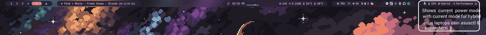
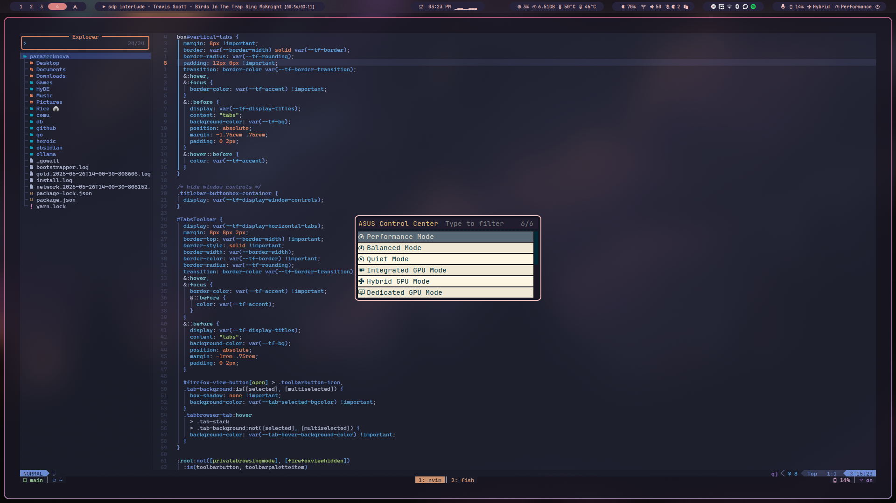
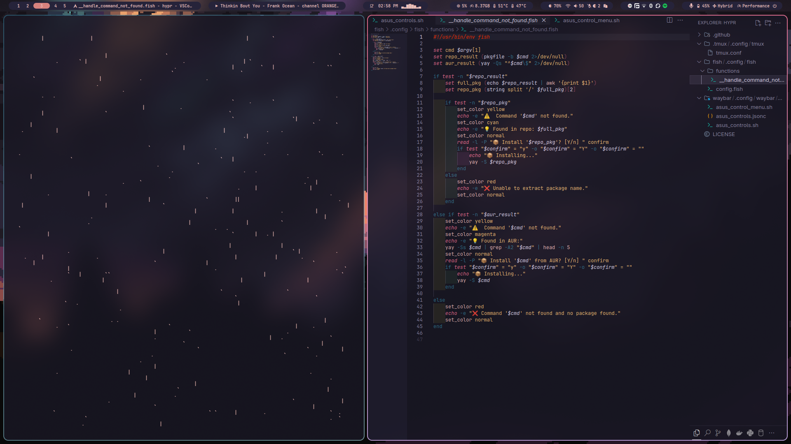
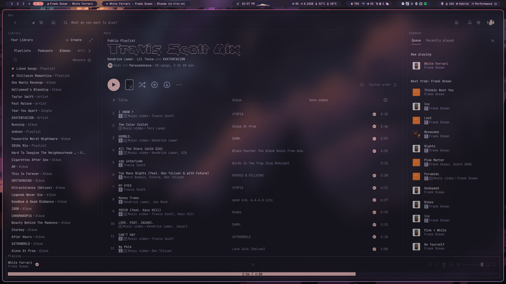

## hypr

Scripts for hyprland/waybar/fish/tmux, including fan control, ASUS-specific integrations (asudsctl &amp; supergfxctl), and fish shell.

>[!NOTE]
> I currently use Arch Linux with Hyprland (HyDE config). The module is made for waybar. You can use stow to copy the module to your waybar config.

### Preview for waybar module (hybrid with performance mode)



I made this module for my use on ASUS TUF Gaming F17 (FX707ZM). It makes switching between hybrid and dgpu mode easier. You can use it for other ASUS laptops as well that support `asusctl` and `supergfxctl`. It uses signals to update the waybar module for your current mode.

> [!NOTE]
> I am planning to add custom fan control profiles like in `ARMOURY CRATE` on windows to the module too, i've already added a rofi menu for power profiles and modeset. (TODO) Add notification for changes, better rofi menu.


It's a rofi menu for power profiles and modeset. Looks not great but it works.

#### Prerequisites

- [asusctl](https://gitlab.com/asus-linux/asusctl) or use `yay -S asusctl` if you use arch btw
- [supergfxctl](https://gitlab.com/asus-linux/supergfxctl) or use `yay -S supergfxctl` if you use arch btw
- rofi - for the menu

#### Installation

```bash
git clone --depth 1 https://github.com/parazeeknova/hypr ~/hypr-config
cd ~/hypr-config
stow waybar # or just copy the files to .config/waybar

# Remember to chmod the scripts
chmod +x ~/.config/waybar/modules/asus_control.sh
chmod +x ~/.config/waybar/modules/asus_control_menu.sh

# Add the module to your waybar config
# Example:
"modules-left": ["custom/asus_control"],

# CAUTION: For HyDE you need to edit the config.ctl file to add the module to the config.

```

### Preview for Hyprland workspace with waybar module

| Nvim  | Tmux |
| :--: | :--: |
|  |  |
