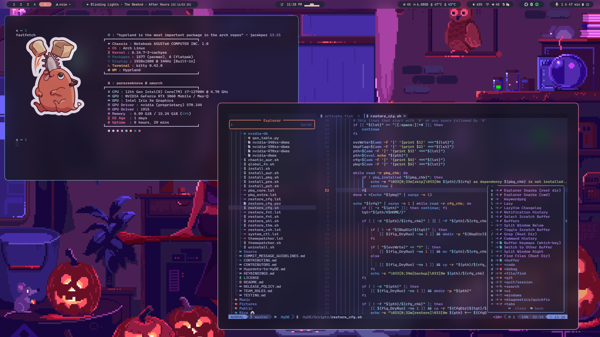
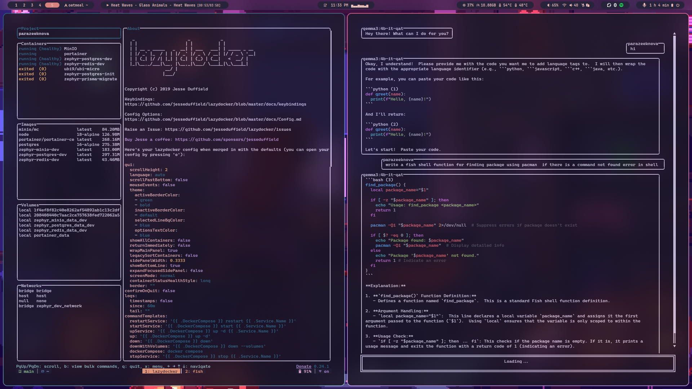

## hypr

Scripts for hyprland/waybar/fish/tmux, including fan control, ASUS-specific integrations (asudsctl &amp; supergfxctl), and fish shell.
Current screenshots are placeholders and showcase my rice :)

>[!NOTE]
> WIP - not all scripts are working yet.

| Nvim  | Tmux |
| :--: | :--: |
|  |  |

## TODO
- [ ] Create script for waybar to show the current fan speed
- [ ] Create script for waybar to show the current modeset (hybrid/igpu/dgpu)
- [ ] Create toggable script for modeset (hybrid/igpu/dgpu)
- [ ] GUI for fan control and modeset
